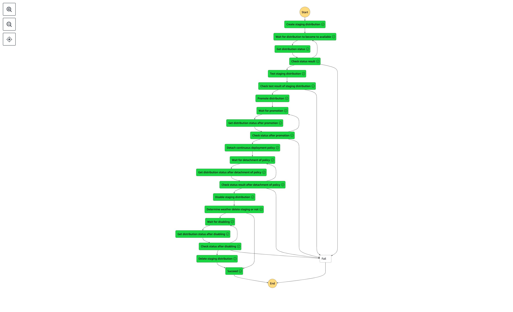

# cloudfront-continuous-deployment-workflow

Amazon CloudFront Continous Deployment を AWS StepFunctions で自動化する

仕様

- Staging distribution と Continuous deployment policy の作成から Promote を行う

- その後、Continuous deployment policy の detach と Staging distribution を削除する後掃除までを行う

# Requirements

Mac 環境かつ asdf 管理にて、ツール群は以下の version にて動作することを確認

- AWS SAM CLI 1.100.0

- Python 3.11.5

- Poetry 1.6.1

# Preconditions

この ワークフローの実行には以下の点を予め満足しておく必要がある。

- 本 ワークフロー用の SAM テンプレートの Stack をデプロイしておく

- ワークフロー実行前に SSM ParameterStore へ、更新したい内容の CloudFront distribution の設定を予め格納しておく

## パラメータの形式

```
aws cloudfront get-distribution-config
```

で取得できるレスポンスのうち、修正したい項目を下のレスポンスの構造を維持してパラメータに格納する。

e.g. `DefaultRootObject` を green/index.html へ変更したい場合、パラメータは以下のような値を格納する。

```
{
  "DistributionConfig": {
      "DefaultRootObject": "green/index.html"
  }
}
```

# How to use

1. AWS SAM CLI にて本 SAM テンプレートをデプロイする

デプロイまでのコマンドは 通常の AWS SAM CLI で可能

```
sam build && sam deploy
```

また、本リポジトリでは Python パッケージ invoke でコマンドのタスク化を行なっている

そのため、以下のコマンドでもビルドからデプロイまでが自動で実行可能

```
inv deploy
```

2. デプロイされた StepFucntions を以下フォーマットの json を入力として実行する

```
{
  "Url": "https://hoge.fuga",
  "PrimaryDistributionId": "既にデプロイされている Primary distribution の ID",
  "DeploymentConfigName": "SSM ParameterStore に格納した CloudFront distribution の設定用パラメータ名",
  "DeleteStagingFlag": Boolean (後掃除で Staging を削除するかどうか ※ 入力しない場合はデフォルトで後掃除)
}
```

以下のフローを辿る StateMachine の処理が起動する



# References

- https://docs.aws.amazon.com/ja_jp/AmazonCloudFront/latest/DeveloperGuide/continuous-deployment.html

- https://boto3.amazonaws.com/v1/documentation/api/latest/reference/services/cloudfront.html
