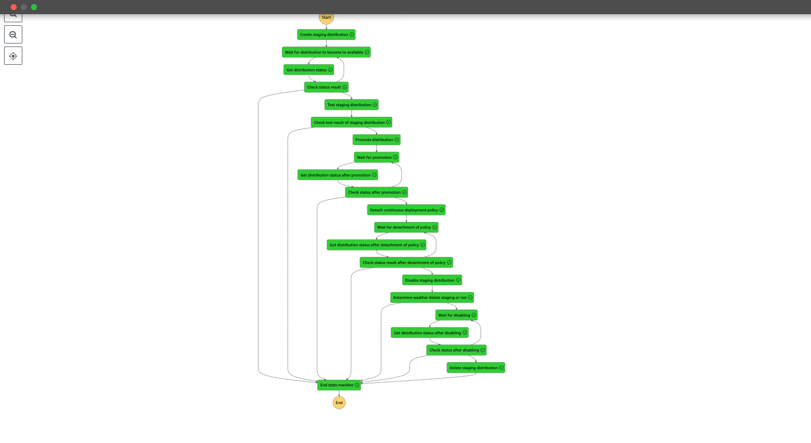

# cloudfront-continuous-deployment-stepfunctions

Amazon CloudFront Continous Deployment を AWS StepFunctions で自動化させる

仕様

- Staging distribution と Continuous deployment policy の作成から Promote を行う

- その後、Continuous deployment policy の detach と Staging distribution を Disabled 状態にする後掃除までを行う

# Requirements

Mac 環境かつ asdf 管理にて、ツール群は以下の version にて動作することを確認

- AWS SAM CLI 1.100.0

- Python 3.11.5

- Poetry 1.6.1

# Preconditions

本リポジトリの StepFunctions では Origin を S3 とする CloudFront を前提としている

そのため事前に Origin となる S3 の以下のパスに index.html を 2 種類用意する

- s3://{S3_BUCKET_NAME}/blue/index.html

- s3://{S3_BUCKET_NAME}/green/index.html

いずれかを CloudFront 経由で閲覧できる状態としておく

# How to use

1. AWS SAM CLI にて本 SAM テンプレートをデプロイする

デプロイまでのコマンドは 通常の AWS SAM CLI で可能

```
sam build && sam deploy
```

本リポジトリでは Python パッケージ invoke でタスク化している

そのため、以下のコマンドでビルドからデプロイまでが自動で実行可能

```
inv deploy
```

2. デプロイされた StepFucntions を以下フォーマットの json を入力として実行する

```
{
  "Url": "https://hoge.fuga",
  "PrimaryDistributionId": "既にデプロイされている Primary distribution の ID",
  "StagingDistributionColor": "Staging に設定する色 (blue or green)"
}
```

以下のフローを辿る StateMachine の処理が起動する



# References

- https://docs.aws.amazon.com/ja_jp/AmazonCloudFront/latest/DeveloperGuide/continuous-deployment.html

- https://boto3.amazonaws.com/v1/documentation/api/latest/reference/services/cloudfront.html
